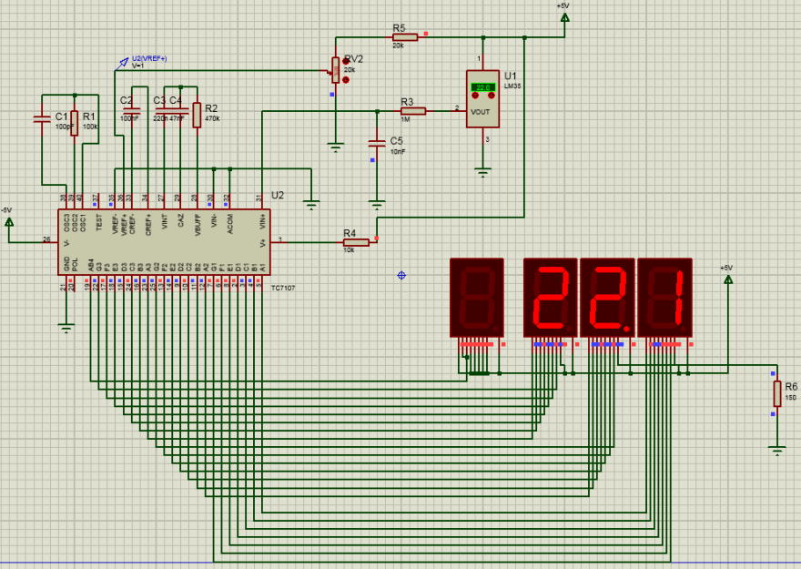
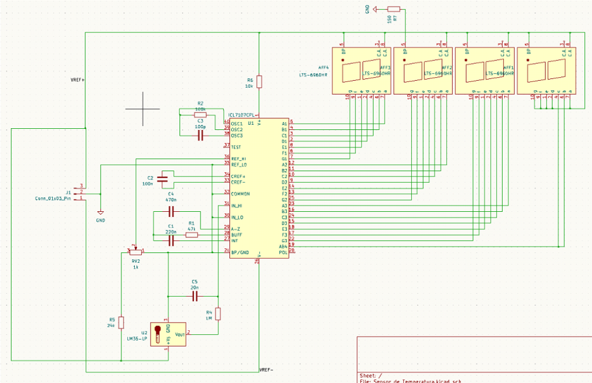
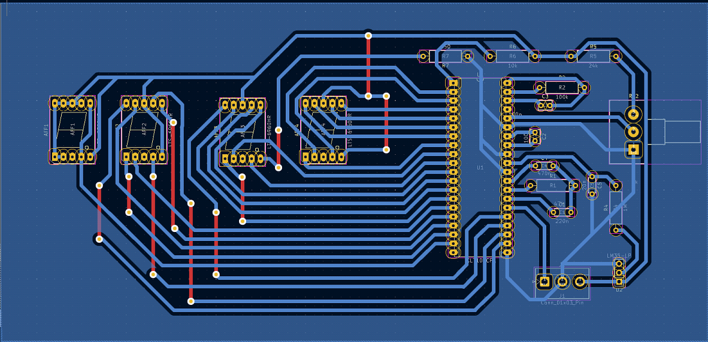
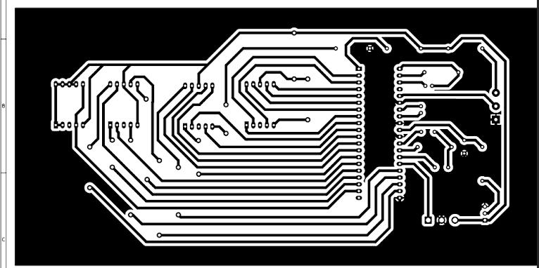
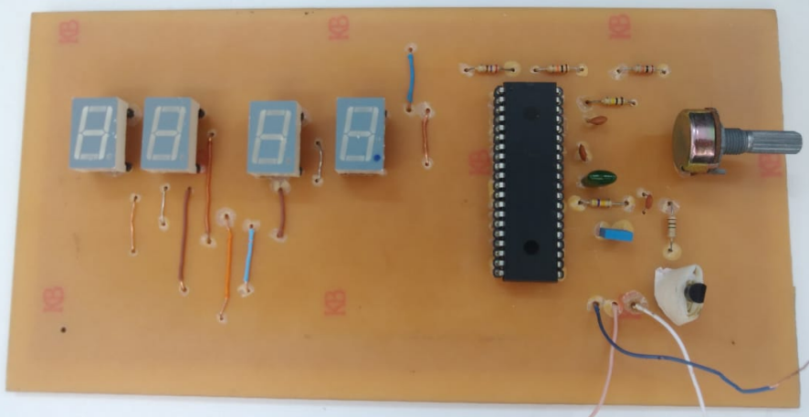

# Termômetro-digital

Termômetro digital desenvolvido durante a disciplina de `Instrumentação analógica`. Utiliza o drive de conversor analogico-digital e LCD de 7 segmentos. O termomêtro foi entregue junto de um relatório ao professor,
[Open PDF Document](./docs/relatorio.pdf)

###  Simulação do Proteus

 

###  Diagrama eletrônico no Kickad

 

###  Roteamento de trilha no Kickad

 

###  Máscara finalizada

 

###  PCB corroída

 

###  PCB finalizada com componentes soldadps

 

Video do funcionamento do termomêtro: `[Visit Google](https://www.youtube.com/watch?v=lSKmLO896dE)` 
